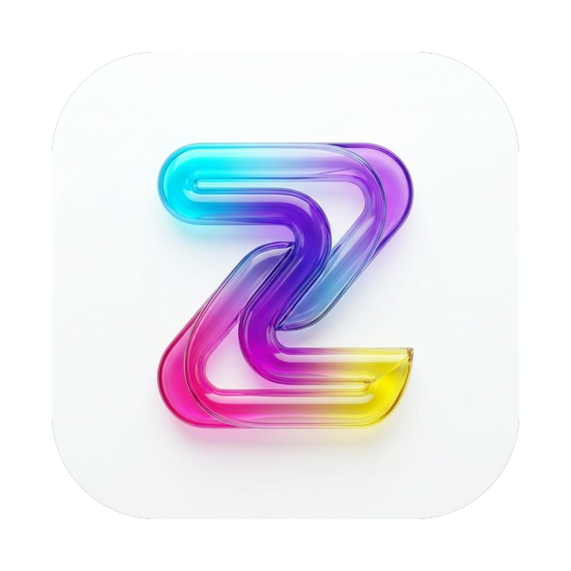
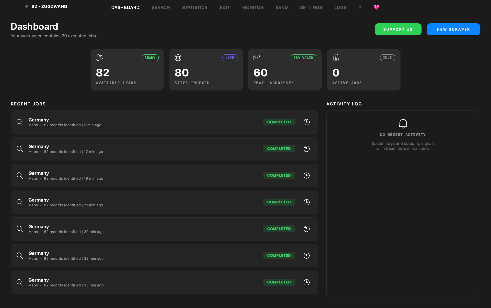
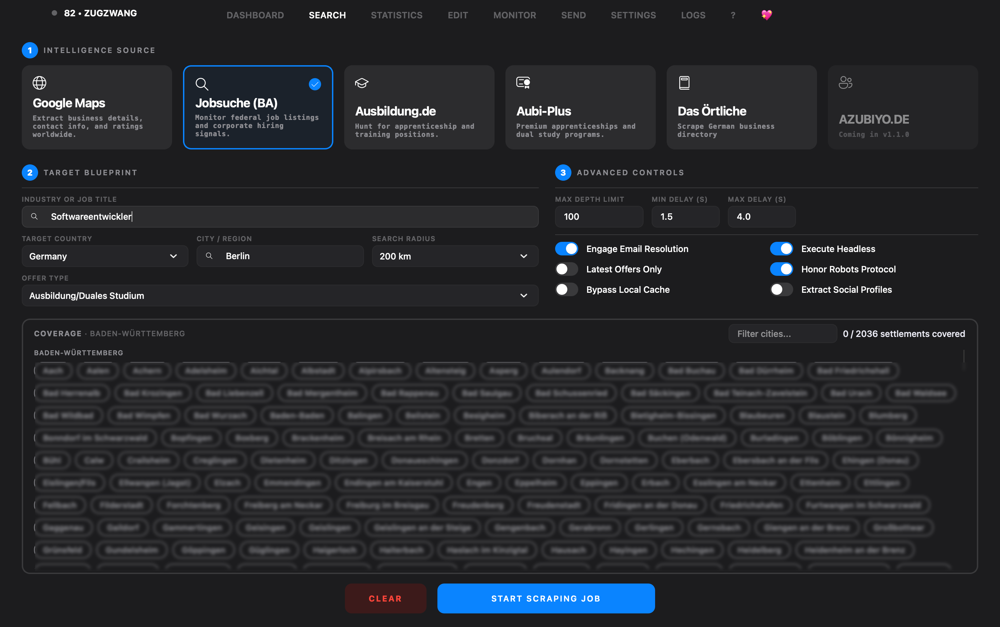
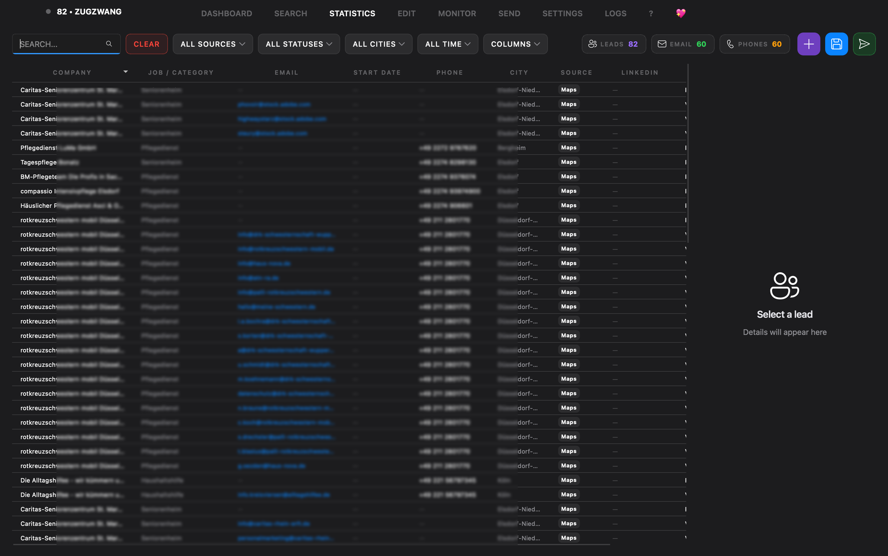
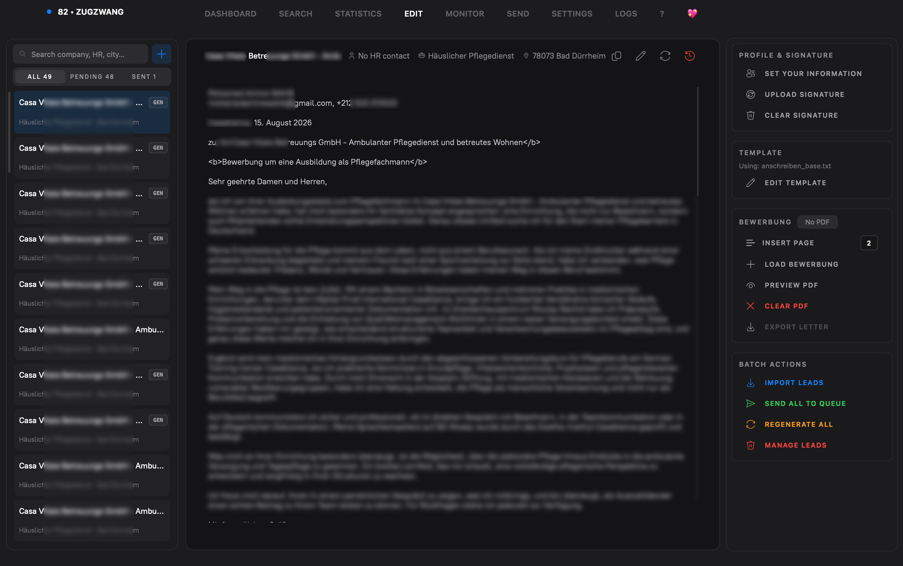
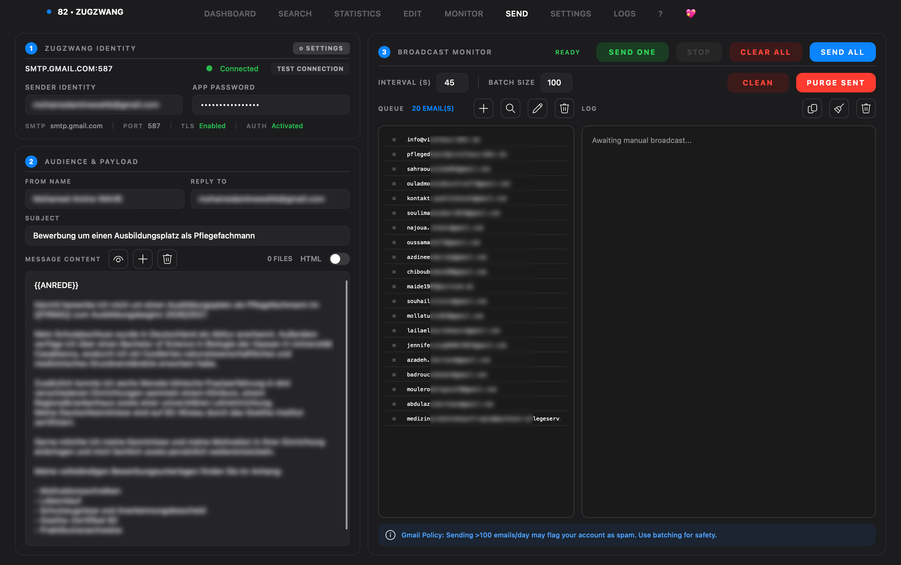
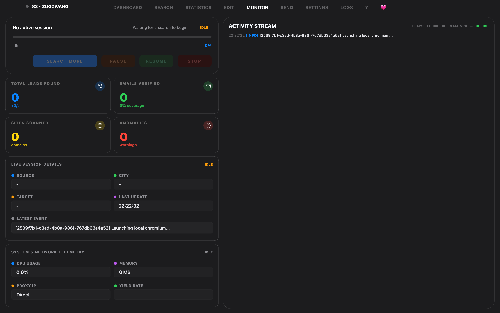
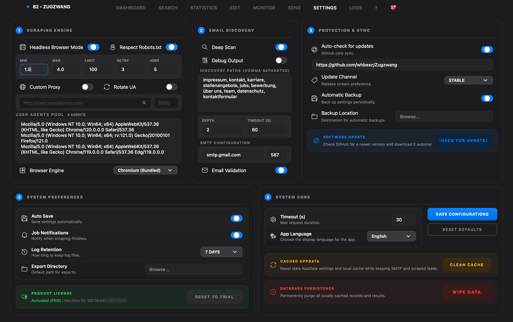

<p align="center">
  
</p>

<h1 align="center">ZUGZWANG</h1>

<p align="center">
  <b>Smart Lead Discovery, Cover Letter Personalization & Outreach Desktop Suite</b><br>
  Designed for job seekers, recruiters, and sales teams across Germany.
</p>

<p align="center">
  <a href="https://github.com/whbexc/Zugzwang/releases"></a>
  
  
  
  
</p>

<p align="center">
  <b>🔍 Search Leads</b> &nbsp;&bull;&nbsp; <b>📑 Tailor Cover Letters</b> &nbsp;&bull;&nbsp; <b>✉️ Safe Outreach</b> &nbsp;&bull;&nbsp; <b>🔒 100% Local & Private</b>
</p>

---

## 💡 What is ZUGZWANG?

**ZUGZWANG** is a desktop application built to turn tedious outreach into an easy, automated workflow. 

Instead of juggling multiple browser tabs, scrapers, Excel sheets, and email drafts, ZUGZWANG handles the entire pipeline in one interface:
1. **Find target companies and job vacancies** across multiple platforms (Google Maps, Bundesagentur für Arbeit, Ausbildung.de, Aubi-Plus, Das Örtliche).
2. **Automatically extract decision-maker contacts** (HR emails, telephone, websites, and postal addresses).
3. **Generate tailored German application packages** (*Bewerbungsmappe*) by combining customized cover letters with your existing PDF CV.
4. **Send personalized outreach emails safely** through your own SMTP/Gmail account with built-in human delay timers and anti-lockdown protection.

---

## ⚡ Highlights

- **Multi-Source Scraping** — Bundesagentur für Arbeit (Jobsuche), Google Maps Places, Ausbildung.de, Aubi-plus, Das Örtliche, Azubiyo.
- **Intelligent Email Extraction** — Direct page scraping, Impressum/Datenschutz discovery, pattern scoring, MX validation, and domain-wide harvesting.
- **Headless & Headed Browser Engines** — Automated Chromium engine with dynamic cookie banner dismissal, stealth headers, and interactive headed CAPTCHA solving.
- **Rich Lead Enrichment** — Automatic phone, street address, website, postal code, and social link discovery.
- **Direct SMTP Outreach Workflow** — Built-in email composer with customizable templates, rate-limiting, and PDF attachment merge.
- **Comprehensive Data Export** — CSV, Excel (`.xlsx`), JSON, and PDF report generation.
- **Modern Fluent Dark UI** — macOS Obsidian aesthetics, glassmorphism accents, keyboard navigation, and responsive real-time streaming updates.

---

## 📦 Downloads (v1.1.1)

Download pre-built standalone binaries from the **[GitHub Releases](https://github.com/whbexc/Zugzwang/releases)** page:

| Platform | File | Instructions |
|---|---|---|
| **🪟 Windows** | `ZUGZWANG_Setup_1.1.1.exe` | Run the installer and launch from your Start Menu. |
| **🍎 macOS** | `ZUGZWANG_macOS_1.1.1.zip` | Unzip, drag `ZUGZWANG.app` to **Applications**, and run the Gatekeeper command below. |
| **🐧 Linux** | `ZUGZWANG_Linux_1.1.1.tar.gz` | Extract archive and run `./ZUGZWANG`. |

> [!NOTE]  
> **macOS First-Time Setup (Ad-Hoc Signing):**  
> If macOS displays a notice that the app cannot be verified, open your **Terminal** and run:
> ```bash
> xattr -cr /Applications/ZUGZWANG.app
> ```

---

### Run from Source (Developers)

#### Prerequisites
- **Python 3.11** or newer
- **Git**

#### Setup Commands

```bash
# 1. Clone this repository
git clone https://github.com/whbexc/Zugzwang.git
cd Zugzwang

# 2. Create and activate a virtual environment
# On macOS / Linux:
python3 -m venv .venv
source .venv/bin/activate

# On Windows (PowerShell):
python -m venv .venv
.venv\Scripts\Activate.ps1

# 3. Install dependencies and the browser engine
pip install -r requirements.txt
playwright install chromium

# 4. Run ZUGZWANG
python main.py
```

---

## ✨ Key Features

* **Multi-Engine Lead Harvesting**:
  * **Google Maps**: Extracts business listings, ratings, addresses, phone numbers, and websites.
  * **Bundesagentur für Arbeit (Jobsuche)**: Direct access to official job postings and apprenticeships across Germany.
  * **Ausbildung.de & Aubi-Plus**: Specialized vocational education and trainee lead extraction.
  * **Das Örtliche**: Comprehensive German commercial telephone and business registry.

* **Smart Website Deep Enrichment**:
  * Crawls discovered company websites to locate hidden `Impressum`, `Kontakt`, and `Karriere` sub-pages.
  * Extracts direct HR emails and contact persons with automated deduplication.

* **Bewerbungsmappe PDF Synthesis**:
  * Custom DIN 5008-aligned German cover letter generator.
  * Seamlessly stitches your custom cover letter and your uploaded PDF resume into a single application PDF.

* **Gmail-Safe SMTP Outreach**:
  * Humanized delay intervals (+5s to +18s jitter between emails).
  * Built-in batch coffee breaks (2.5-minute pause every 12 emails) to prevent rate limits.
  * Real-time sending queue with pause, resume, and retry controls.

* **Privacy & Security**:
  * Runs 100% locally on your computer.
  * No external third-party tracking, telemetry, or cloud databases.
  * Optional startup PIN protection for sensitive candidate data.

---

## 📸 Interface Preview

### 1. Central Dashboard
<p align="center">
  
</p>

### 2. Search & Lead Harvesting
<p align="center">
  
</p>

### 3. Lead Results & Export (Excel / CSV)
<p align="center">
  
</p>

### 4. Cover Letter & Application Editor
<p align="center">
  
</p>

### 5. Safe Email Outreach Queue
<p align="center">
  
</p>

### 6. Live Scraper Monitor & Diagnostics
<p align="center">
  
</p>

### 7. Application Settings
<p align="center">
  
</p>

---

## 📧 How to Set Up Gmail for Sending

To send applications using your Gmail account:
1. Go to your **[Google Account Security](https://myaccount.google.com/security)** page.
2. Enable **2-Step Verification** if it isn't already enabled.
3. Search for **App passwords** (or visit `https://myaccount.google.com/apppasswords`).
4. Generate a 16-character password named `ZUGZWANG`.
5. Open ZUGZWANG **Settings > Email Configuration** and paste your Gmail address and the 16-character App Password.

---

## 🛠️ Building Standalone Binaries Locally

If you wish to package your own executable files locally:

```bash
# Package the standalone application with embedded Chromium
python build_with_browsers.py

# Package Windows Setup with Inno Setup
iscc installer.iss

# Package Windows Setup with NSIS
makensis installer.nsi

# Package macOS Application Bundle (.app / .zip)
bash scripts/build_macos.sh
```

---

## 📝 Changelog

See full version history and release notes in the in-app **What's New** dialog or in [`src/changelog.py`](file:///Users/WAHB/Desktop/WAHB/Zugzwang/src/changelog.py).

---

## 📄 License & Legal Notice

Copyright &copy; 2026 ZUGZWANG. All rights reserved.  
ZUGZWANG is designed for legitimate recruitment, job searching, and business contact outreach. Users are responsible for complying with relevant local regulations (including GDPR and anti-spam laws) regarding unsolicited commercial communications.
<!-- 1.1.1 -->
